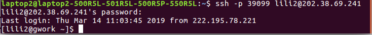

[TOC]

# 集群学习

## 目录

1. 参考文献
2. 如何登录集群
3. 节点与文件系统管理
4. 测试节点测试docker
5. 通过Torque PBS提交任务

## 参考文献

<http://mccipc.ustc.edu.cn/mediawiki/index.php/Main_Page>

<http://mccipc.ustc.edu.cn/mediawiki/index.php/Gpu-cluster-manual>

<https://wmg.ustc.edu.cn/wiki/index.php/%E9%9B%86%E7%BE%A4:%E4%BF%A1%E9%99%A2_GPU_%E9%9B%86%E7%BE%A4#.E6.96.87.E4.BB.B6.E7.B3.BB.E7.BB.9F.E7.BB.93.E6.9E.84>

<http://mccipc.ustc.edu.cn/mediawiki/images/4/47/Torque%E4%BD%BF%E7%94%A8%E6%89%8B%E5%86%8C.pdf>

如有侵权请联系 zzpzkd@mail.ustc.edu.cn

## 1.如何登录集群

首先要有一个帐号，我们这里假设有了一个帐号，

```
帐号和密码是：lili2/*******
```

关于如何申请帐号?

- GPU/CPU集群帐号申请方法

- 信息学院的学生将姓名、学号、导师和集群类型信息发邮件给ypb@ustc.edu.cn,并抄送导师，导师邮件确认后即可创建帐号。申请帐号成功后，请加入GPU使用群，修改昵称为姓名_帐号。
- 集群类型指的是要CPU集群还是GPU集群，这里我们申请的是GPU集群

拿到帐号后即可以登录集群：ps.一些基本知识：我们要登录的集群的地址：内网地址192.168.9.99，外网SSH连接：202.38.69.241:39099

我按照官网上的操作，**这里要注意把帐号的用户名改成自己的**

```
ssh -p 39099 lili2@202.38.69.241
```

反馈的结果如下图，已经登录成功



## 2.节点与文件系统管理

在这一个章节，主要介绍四个内容：节点的概念/文件系统的组成/如何登录自己的文件系统/如何上传文件

登录成功之后首先要明白我们目前在哪里，所以在这一节中这一节介绍一些基础知识

1.我们要登录的GPU集群已知包括以下节点：

- 登录节点 *gwork*，用于外部访问和提交 Torque PBS 或 Slurm 任务，目前我们就处于这个节点
- PBS 计算节点 *G101~G125*，每个节点有8个 1080Ti GPU
- Slurm 计算节点 *dgx01* 和 *dgx02*，两个节点各有8个 Tesla V100 GPU
- Torque PBS 是和 Slurm 类似的另一套集群任务调度工具。
- G101节点是一个测试节点，就是说这个节点专门用于登录后的测试，真正熟悉之后再用其他节点执行任务

2.集群所有结点共享数据存储，有三个共享mount点，分别是：

-  /ghome  用户的根文件系统，用于存放代码等重要数据，限额50G
-  /gdata  用户的数据区，用于存放job运行过程生成的数据以及结果，用户可读写，暂限额500G。
-  /gpub   公共数据集集区，用户只读，对于一些下载的公共数据集，可以提交管理员转移到这里，将不会占用个人的磁盘限额。

3.如何通过进入ghome下自己的文件夹和gdata下自己的文件夹：打开默认的文件管理器，选最下面的“连接到服务器”，输入网址，输入用户名和密码即可，具体操作可以看下面的图


4.如何往自己的文件夹中上传自己的文件

- 如果是运行代码文件，直接复制粘贴到ghome下的自己的文件夹里就行
- 如果是数据文件，也是复制粘贴到相应文件夹里

##  3.测试节点测试docker

1.首先先来了解一下Docker的概念

- 为什么要用到Docker？

  计算集群中各计算节点必须保证软件环境同步。系统软件由管理员人工保持同步（手动安装相同的软件）。系统软件只能安装一套，因此经常出现有的人需要的软件版本与系统中软件版本不一致的情况。集群通过 Docker 容器为用户提供多种不同的软件环境。

- Docker是干什么的？

  Docker 容器可以看作一个与主系统隔离的虚拟机环境。可以在不同的容器中安装不同的软件环境，比如有的容器安装了 CentOS 系统 + CUDA8，另一些容器安装了 Ubuntu + CUDA9 + TensorFlow，你可以根据自己的需求选择一个最方便使用的容器作为自己的基础环境。每个用户启动的容器都是从镜像生成的一个全新副本，互不干扰。

- Docker怎么用？

  这里介绍一些基本操作。注意用户只能在计算节点 G101~G125 上启动 Docker 容器。G101 是测试节点，可以直接登录上去操作下面的命令。其他节点则需要通过 Torque PBS 提交任务脚本使用。直接登录的指令是

  ```
  ssh G101
  ```

  来看一下执行该指令后的页面变化

  

- 区分镜像和容器的概念：镜像是已经配置好的一些虚拟环境，容器是用户申请的工作环境，是系统分配的一个基于某一个镜像的虚拟工作环境，相当于一个虚拟机，你在内部对系统所做的任何操作都将在系统退出后丢失，但对用户根目录下（/ghome/<username>）的文件操作将不会丢失

2.在G101测试节点上测试一些命令(如果运行结果图片看不清可以放大看)

- ```
  sudo docker images
  ```

  该指令作用：查看可用的Docker镜像，上面有一些详细的信息

  该指令执行后的结果

  

- ```
  sudo docker ps -a
  ```

  该指令的作用：产看正在使用的容器的情况

  该指令的运行结果

  

3.在G101测试节点中进入docker容器中，运行程序

- 首先假设我的测试代码文件为mytest.py，为了测试简便，里面我就写了一行代码，输出helloword

  ```
  文件：/ghome/username/mytest.py
  print("hello","world");
  ```

- 登录G101节点，命令是

  ```
  ssh G101
  ```

- 由于测试节点没有tensorflow，所以必须要进入到docker中，运行如下指令，这将从 **bit:5000/deepo** 镜像生成一个新的容器，并启动一个 bash 给你使用。你可以在里面运行各种各样的程序，就像在任何 Linux 系统上一样。同时你在外面的家目录/ghome/username也被默认挂载到容器当中了

  ```
  startdocker -u "-it" -c /bin/bash bit:5000/deepo
  ```

  当然了我的测试代码过于简单，和tensorflow真的没有任何关系，似乎有点画蛇添足的意思。但是当以后运行更厉害的代码时，这一步就必不可少了

- 运行指令，得到结果

  ```
  python /ghome/lili2/mytest.py
  ```

- 运行结束，运行 `exit` 命令将退出回到 G101 节点。注意：容器中运行的最后一个程序（此处就是 bash）退出后，容器将会被销毁，这意味着除了你在容器外面共用的存储空间（如/ghome/username）写入的文件以外，其他文件都会被销毁！ 因此，容器中运行的程序应该把结果保存到容器外共用的存储空间中

  ```
  exit
  ```

- 由于docker容器一旦启动，不管是否在容器里运行任务都会占用GPU，因此请各位同学养成良好的调试习惯，在调试完成后请及时使用exit命令退出容器（不要直接关掉terminal，那样不会将容器停止）。

  - [ ] 正常退出的容器将会被自动销毁，

  - [ ] 如果非正常退出，请使用下面第一个指令，查找到自己的容器名或容器id，使用下面第二个指令将其停止

    ```
    sudo docker ps
    ```

    ```
    sudo docker stop CONTAINER_ID/CONTAINER_NAME
    ```

  如果不及时清理无用的容器将会导致其他同学无法正常初始化容器，所以请大家不要在启动容器后长时间挂机。

- 整个运行过程的截图

  

- 

## 4.通过 Torque PBS 提交任务

如果在测试节点运行程序没有问题，就可以到正式节点上编写脚本提交任务了

**！！注意只能在 gwork 节点上提交任务，不能在测试节点提交！**

一共有下面几个步骤

1. 编写任务脚本：Torque 管理系统不能直接提交二进制可执行文件，需要编写一个文本的脚本文件，来描述相关参数情况。下面是一个示例脚本文件 myjob.pbs （假设代码文件依然是上面的mytest.py）：

   ```
   #PBS    -N  testjob
   #PBS    -o  /ghome/<username>/$PBS_JOBID.out
   #PBS    -e  /ghome/<username>/$PBS_JOBID.err
   #PBS    -l nodes=1:gpus=1:S
   #PBS    -r y
   #PBS    -q mcc
   cd $PBS_O_WORKDIR
   echo Time is `date`
   echo Directory is $PWD
   echo This job runs on following nodes:
   echo -n "Node:"
   cat $PBS_NODEFILE
   echo -n "Gpus:"
   cat $PBS_GPUFILE
   echo "CUDA_VISIBLE_DEVICES:"$CUDA_VISIBLE_DEVICES
   startdocker -c "python /ghome/<username>/mytest.py"  bit:5000/deepo
   ```

   解释说明

   - 脚本文件中定义的参数默认是以#PBS 开头的，这就是为什么每一行都有#PBS

   - -N 定义的是 job 名称，可以随意

   - -o 定义程序运行的标准输出文件，如程序中 printf 打印信息,相当于 stdout，注意<username>要改成自己的用户名，所有程序运行的结果会存在那个文件中

   - -e 定义程序运行时的错误输出文件,相当于 stderr，注意<username>要改成自己的用户名，所有程序输出的错误信息会存在那个文件中

   - -l 定义了申请的结点数和 gpus 数量

     nodes=1 代表一个结点，一般申请一个结点，除非用 mpi 并行作业

     gpus=1 定义了申请的 GPU 数量,根据应用实际使用的 gpu数量来确定

     S 表示 job 类型，

     - [ ] 使用单核的 job 必须加参数 S,如：#PBS -l nodes=1:gpus=1:S
     - [ ] 使用双核的 job 必须加参数 D,如：#PBS -l nodes=1:gpus=2:D
     - [ ] 使用>=3 核的 job 必须加参数 M,如：#PBS -l nodes=1:gpus=6:M

     队列系统的默认 job 请求时间是一周，如果运行的 job 时间估计会超过，则可以使用下面的参数：表示请求 300 小时的 job 时间

     ```
     #PBS -l nodes=1:gpus=1:S,walltime=300:00:00
     ```

   - -r y|n 挃明作业是否可运行，y 为可运行，n 为不可运行

   - -q 表示排在哪个队列中，默认是排在batch队列中，后面加上mcc表示排在mcc队列中

   - 后面的 cat 和 echo 信息是打印出时间、路径、运行节点及GPU 分配情况等信息，便于调试

   - 最后一行是执行自己程序的命令，详细解释请看第2步

   - 除了.pbs后缀的脚本文件，还可以是shell脚本或python脚本，但都需要在第一行加解释器，

     - [ ] shell脚本（.sh）需要在第一行加： #!/bin/bash
     - [ ] python脚本（.py）需要在第一行加：#!/usr/local/bin/bash

   - 

2. 最后一行的命令详解

   最后一行的命令其实就是执行自己的程序./my_proc，但是由于程序执行需要借助docker容器的虚拟环境，所以要用到startdocker命令，下面是startdocker命令的解释

   startdocker命令的模板是这样的

   ```
   startdocker  -P <my-proc-config-path> -D <my-data-path>-s <my-script-file> bit:5000/deepo
   ```

   - startdocker是对nvidia-docker的再一次封装，主要为了配合torque pbs和避免root权限管理漏洞

   - -P 参数用来指定代码或配置文件所在的主目录，通常取配置文件和可执行文件的公共父目录，

     如配置文件是/gdata/userx/proc1/conf/my.conf，可执行文件/gdata/userx/proc1/shell/my.sh，则可以取 -P/gdata/userx/proc1  , -s shell/my.sh 

     如果代码就在自己的home目录下，则此参数可以不用设置

   - -D 参数用来指定数据所在目录。如可以是 -D /gdata/userx/proj1，可以没有，如和-P 参数一样则必须省略

   - 需要注意的是D和-P参数不宜使用太高级别的目录如/gdata /ghome等，至少应该到用户的所在目录层次，如/gdata/userx等

   - -s 参数是可执行二进制或脚本文件名，可以给出绝对路径或相对于-P 的相对路径。-s 参数后的my-script-file 可以是shell脚本或python脚本，但都需要在第一行加解释器，

     - [ ] shell脚本（.sh）需要在第一行加： #!/bin/bash
     - [ ] python脚本（.py）需要在第一行加：#!/usr/local/bin/bash

     一个范例如下，这里的mytest.py就是python脚本，这里代码就是在自己的home目录下，没有数据载入，所以只有-s参数

     ```
     startdocker -s /ghome/username/mytest.py bit:5000/deepo
     ```

   - -s还有一个替代命令-c，-c 是执行命令行，和-s 的区别是本参数不会处理相对路径，只解释为命令行，和-s 两者中只能出现一个。

   - 最后的bit:5000/deepo是镜像名称，也可以替换成别的镜像名称

   - startdocker命令的一种简便模式就是下面这个样子，下面的mytest.py就是自己的python程序

     ```
     startdocker -c "python /ghome/<username>/mytest.py"  bit:5000/deepo
     ```

   - 最后再介绍一下在容器中挂在多个目录

     首先刚才介绍的-P 还是-D 参数指定的目录其本质都是使用docker的-v参数进行了卷的挂载

     那么如果两个挂载点依然不够用（比如我想要运行的程序存在两个文件夹下），或者挂载后容器内外目录结构不一样，这个时候就要用-u参数进行挂载点的扩展

     -u参数怎么用？

     - [ ] 针对于挂载后容器内外目录结构不一样的情况：比如需要将/gdata/userx 挂载到容器内部的/userx,可以这样设置-u:  

       ```
       -u "-v /gdata/userx:/userx"
       ```

     - [ ] 针对于两个挂载点不够用的情况，如果需要挂载更多的目录，在 `-u` 后面的引号中增加新的 `-v /XXX:/XXX` 参数就行了（注意路径要用绝对路径）

     - [ ] -u 其实支持其他任意形式的docker参数的传入，如 -u "--ipc=host"等，

     - [ ] 另外，容器启动时工作目录是在容器内的根目录。你的程序里若使用的相对路径可能会出现无权限写文件的错误。可以在 `-u` 后面的引号里添加 `-w 工作目录` 设置容器中的初始工作目录（当然工作目录必须挂载到容器中）：

       如，想要在容器中运行 /ghome/userx/run.sh，那么运行下面的指令就可以使工作目录和容器外的当前工作目录一致（PWD 环境变量是当前工作目录路径）

       ```
       startdocker -u "-v /gdata/用户名:/gdata/用户名 -w ${PWD}" -s /ghome/用户名/run.sh bit:5000/deepo
       ```

     - [ ] 

   - 
   - 

3. 提交任务

   用下面的指令提交任务，注意要在gwork节点提交任务

   ```
   qsub myjob.pbs
   ```

   返回的结果是自己的任务编号

   

4. `qstat` 命令用于查看任务状态，可以直接加任务编号，或者加 `-u 用户名` 查看用户的所有任务（R 状态表示正在运行，C 表示运行完毕、Q 表示正在排队）：

   

5. 过了一会，我的程序运行好了，会看到我的文件夹下多了两个文件，都是返回的两个结果文件（我的电脑中打不开.out文件和.err文件，所以我把它们的后缀名改成了.md和.txt）

   

   其中，因为没有输出错误，所以后一个文件里买没有内容

   前一个文件中的内容展示在下面了，可以对照看看

   ```
   Time is Wed Mar 27 21:15:58 CST 2019
   Directory is /ghome/lili2
   This job runs on following nodes:
   Node:G102
   Gpus:G102-gpu6
   CUDA_VISIBLE_DEVICES:6
   ===== OUTPUT =====
   hello world
   ```

6. 其他指令

   

7. 

8. 

## 5.python程序与python脚本？

假设运行环境就是自己的电脑，没有进入集群环境下

编写python程序为test1.py

```
文件：test1.py

``
print("hello world");
```

运行此程序

再编写python脚本为test2.py

```
文件：test2.py

​```
#!/usr/bin/env python
print("hello world");

```

运行此脚本的

最后给出运行的指令以及结果的截图，可以看到python程序和python脚本的不同之处


