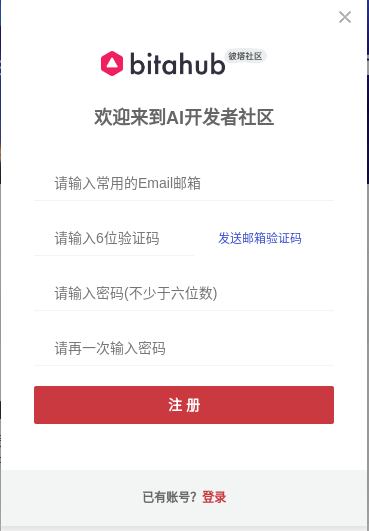
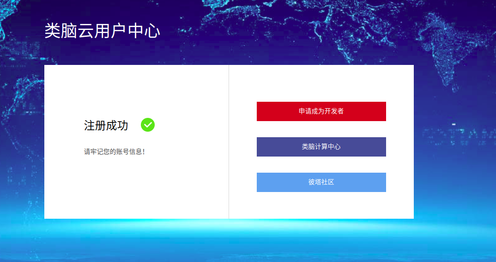
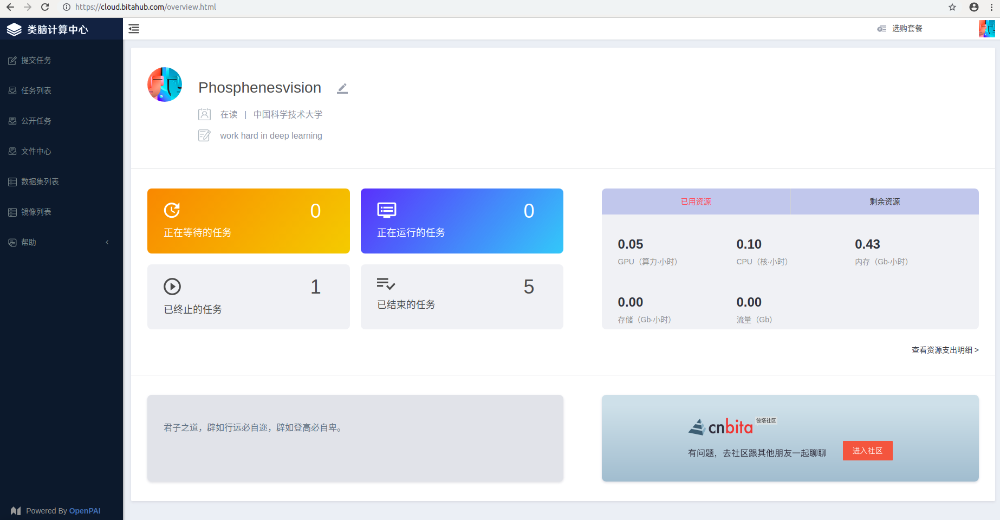
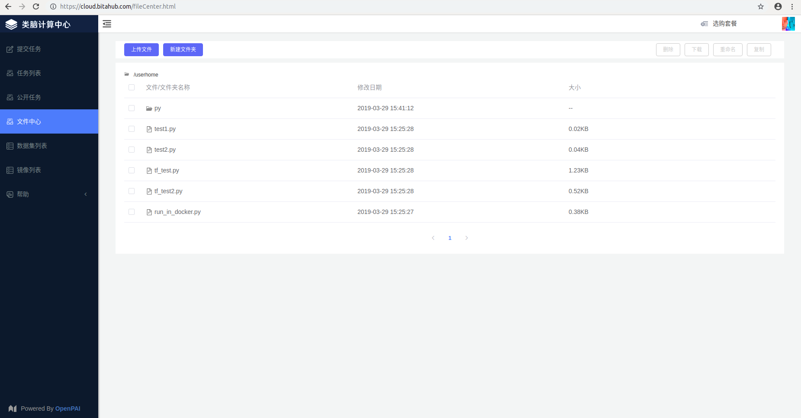
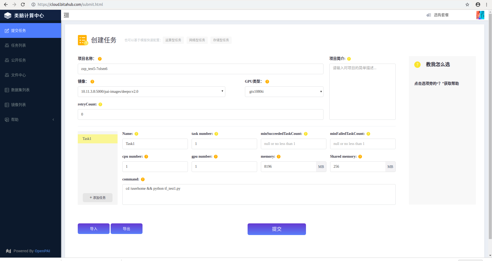
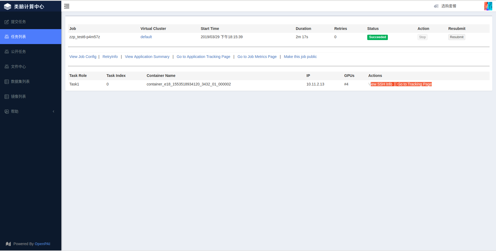

# 关于怎么使用类脑的GPU集群

so easy！

侵权联系zzpzkd@mail.ustc.edu.cn

## 1.首先申请帐号

脑GPU集群的网址是<https://www.bitahub.com/>

首先需要注册一个彼塔社区的帐号，这个时候邮箱要用我们科大的邮箱



这个申请递交上去马上就会成功



第二步，申请完帐号后，点击右边“申请成为开发者”，由于我现在已经申请成功了，所以那个页面就点不进去了，就不能去截图了，申请界面在邀请码那一栏直接空着，不填，大概过个半天时间，帐号审核通过了

## 2.登录并且上传自己的文件和数据

首先，点击上一张截图右边的“类脑计算中心”，就算是登录上这个集群了



然后点击左边的文件中心上传自己的程序和需要的数据，如果数据过大，建议上传压缩包，然后在线解压，

文件存储的位置是/userhome，



## 3. 提交任务

点击左侧“提交任务”，进入提交页面，一共有两种方式进行提交



1. 一个一个空格来填，可以按照我给的截图来填，如果看不清图片的话可以放大一下看

   - [ ] 项目名称：随便填个名称

   - [ ] 镜像：这个集群也是用docker操作的，有下拉菜单可以选，深度学习用到的镜像是10.11.3.8:5000/pai-images/deepo:v2.0

   - [ ] GPU类型：选择用的GPU的类型，有下拉菜单

   - [ ] 项目简介：可以空白

   - [ ] retrycount：空白

   - [ ] 下面的task name：随便写一个

   - [ ] tasknumber：有几个写几个，也可以不写，系统会自己配置的

   - [ ] minSucceededTaskCount：空白，不写

   - [ ] minFailedTaskCount:：空白，不写

   - [ ] cpu number：用到的cpu数量

   - [ ] gpu number：用到的gpu数量

   - [ ] memory：用到多少内存

   - [ ] shared memory：可以不写，也可以写个256mb

   - [ ] command：就是写自己要执行的命令，开头必须写一个cd /userhome，然后执行程序，最后写一个sleep 5s，各个命令之间用&&连接，最后那个sleep的命令的意思是，程序执行结束后5s退出容器

   - [ ] 如果想要输出结果单独形成一个文件，还可以用到指令

     ```
     cd /userhome && python start.py --output=/userhome/xx
     ```

     

   - [ ] 

   - [ ] 

   - [ ] 

2. 如果嫌这样太麻烦，可以自己写一个.json文件，描述一下项关的配置，然后点击导入，这样所有的空格就会自动填充信息了，一个.json文件范例如下

   ```
   zzp_test5-9xo51b.json：
   
   {
       "jobName": "zzp_test5-9xo51b",
       "image": "10.11.3.8:5000/pai-images/deepo:v2.0",
       "gpuType": "gtx1080ti",
       "retryCount": 0,
       "taskRoles": [
           {
               "name": "Task1",
               "memoryMB": 8196,
               "shmMB": 256,
               "taskNumber": 1,
               "cpuNumber": 1,
               "gpuNumber": 1,
               "minFailedTaskCount": null,
               "minSucceededTaskCount": null,
               "command": "cd /userhome && python tf_test1.py"
           }
       ]
   }
   ```

   如果不会写.json文件也没有关系，直接先自己填空格，然后点“导出”按钮，这样就是保存了本次配置的文件了

3. 最后点击“提交”按钮就可以了

## 4.查看任务状态

提交任务之后点击左侧任务列表就可以查看已经提交到的任务状态

点进一个具体的任务还可以看该任务的具体信息，

执行成功后点右边的[Go to Tracking Page]可以看执行结果

